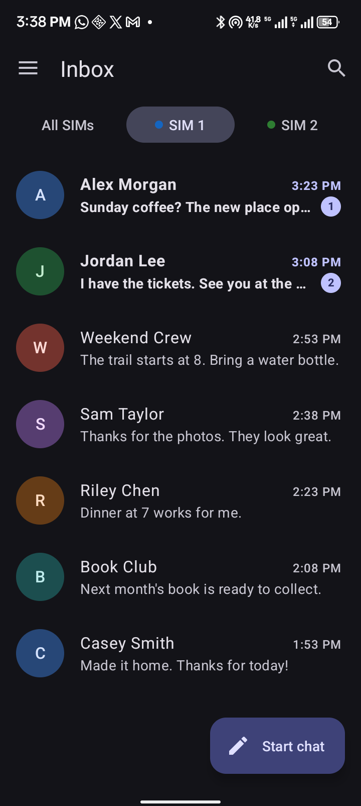
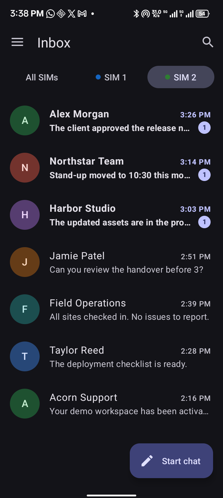
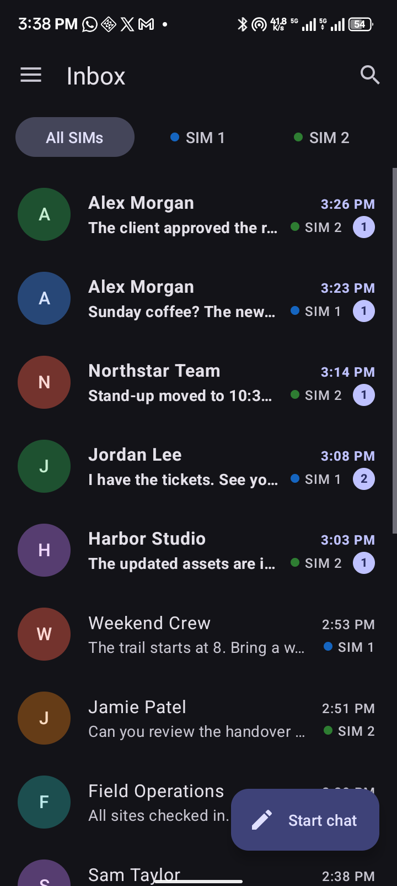
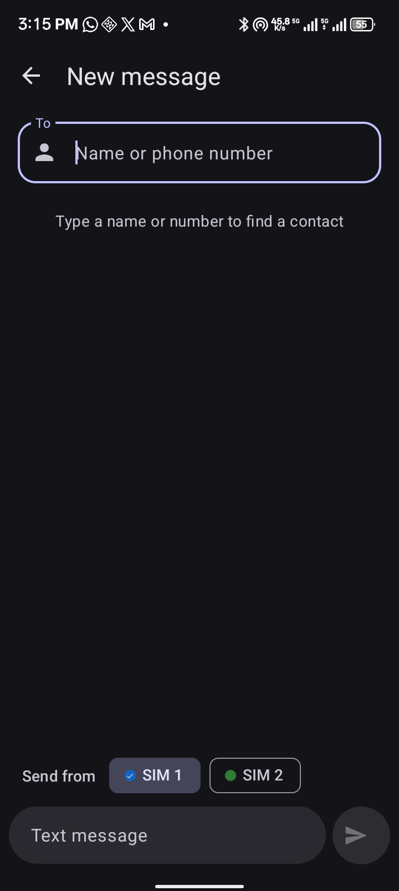
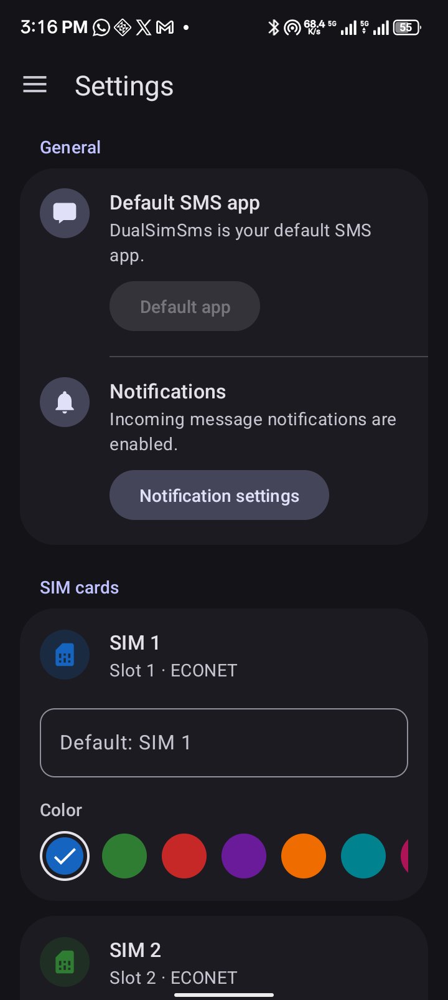

<div align="center">

# DualSimSMS

**Two SIMs. Two message tabs.**

An Android SMS app that splits your messages into separate SIM tabs. Swipe between each number’s inbox, or bring both together in All SIMs.


[Features](#features) · [Screenshots](#screenshots) · [Quick start](#quick-start) · [Development](#development)

<table align="center" width="600">
  <tr>
    <td width="50%" align="center" valign="top"><br><sub>SIM 1: one number, its own messages</sub></td>
    <td width="50%" align="center" valign="top"><br><sub>SIM 2: a separate inbox for your other number</sub></td>
  </tr>
</table>

</div>

---

Keep both numbers in view without losing track of which SIM a message belongs to. Browse all messages together or filter by subscription, choose the SIM before sending, and give each subscription a name and color you recognize.

## Features

| Feature | What it does |
|---|---|
| **Messages split by SIM** | Each active subscription gets its own message tab. Swipe between SIM 1 and SIM 2 without mixing their conversation lists; All SIMs provides a combined view. |
| **Inbox, sent, and drafts** | Browse message folders from the navigation drawer, with unread badges and message search. |
| **Choose before sending** | A visible SIM selector in the composer and conversation screen makes the sending subscription clear. |
| **Contacts and drafts** | Find recipients by name or number, see SMS character/segment counts, and keep automatically saved drafts when the app has the default SMS role. |
| **Delivery feedback** | See sending, sent, delivered, and failed states, with incoming-message notifications. |
| **Make SIMs recognizable** | Set a custom name and preset color for each active subscription; settings persist in DataStore. |
| **Fits the device theme** | Material components, light and dark resources, and edge-to-edge layouts. |

## Screenshots

The two inboxes above are the main workflow: **the same contact can appear in both tabs while each tab shows the messages for its own subscription**. All SIMs merges the lists and adds SIM badges to conversation rows.

<table align="center" width="750">
  <tr>
    <td width="33%" align="center" valign="top"><br><sub>Bring both numbers together</sub></td>
    <td width="33%" align="center" valign="top"><br><sub>Choose the sending SIM</sub></td>
    <td width="33%" align="center" valign="top"><br><sub>Name and color each SIM</sub></td>
  </tr>
</table>

Captured on a connected dual-SIM Android device. The split inboxes show demo conversations in the real app UI; your device messages stay private.

## Quick start

**Requirements:** Android 9 or newer (`minSdk 28`). Building requires an Android SDK with the project's compile SDK 36.1 and a JDK compatible with its Android Gradle plugin.

### Build and install

From the repository root:

```sh
sh gradlew assembleDebug
adb install -r app/build/outputs/apk/debug/app-debug.apk
```

On Windows, use `gradlew.bat assembleDebug`.

The application ID is `com.example.dualsimsms`. Open **DualSimSms** after installation.

### Device setup

1. Grant the SMS, phone-state, and contact permissions the app requests.
2. Choose **DualSimSms** as the default SMS app when prompted, or use **Settings → Make default**.
3. Enable notifications if you want incoming-message alerts.
4. In **Settings**, choose names and colors for your active SIM subscriptions.

Dual-SIM behavior needs two active subscriptions. The app discovers active subscriptions from Android rather than assuming fixed subscription IDs.

## Usage

- **Read:** choose **All SIMs** or a subscription tab. Open a conversation to read its messages.
- **Find:** use the toolbar search to filter conversations and message content.
- **Compose:** tap **Start chat**, select a contact or enter a phone number, then choose **Send from** before sending.
- **Review folders:** use the drawer to open Inbox, Sent, or Drafts.
- **Customize:** open Settings to rename SIMs and choose their badge colors.

## Scope and permissions

This version handles **SMS text messages**. Picture messages and group messages through **MMS are not supported**. Consider that limitation before making it your default messaging app.

Messages are read from and saved through Android's SMS provider. SIM settings are stored separately in DataStore. Changing the default SMS app does not delete existing device messages. Sending and automatic message saving depend on the default SMS role and the required Android permissions; delivery receipts also depend on carrier/device support.

## Development

```sh
sh gradlew testDebugUnitTest lintDebug assembleDebug
```

For instrumentation tests on an emulator or connected test device:

```sh
sh gradlew connectedDebugAndroidTest
```

| Path | Contents |
|---|---|
| `app/src/main/java/com/example/dualsimsms/ui/` | Inbox, conversation, composer, settings, and view models |
| `app/src/main/java/com/example/dualsimsms/data/` | SMS, contacts, subscriptions, and persistent SIM settings |
| `app/src/main/java/com/example/dualsimsms/telephony/` | Sending, receiving, delivery status, and notifications |
| `app/src/main/java/com/example/dualsimsms/util/` | Search, filtering, grouping, and draft logic |
| `app/src/main/res/` | Material layouts, strings, icons, and theme resources |
| `docs/screenshots/` | README device captures |

## License

[MIT](LICENSE).
